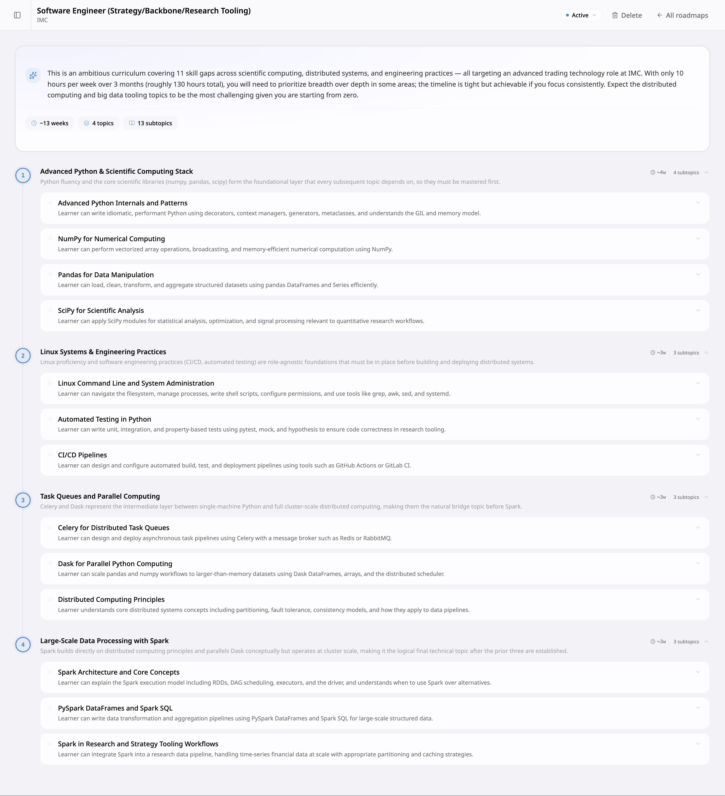
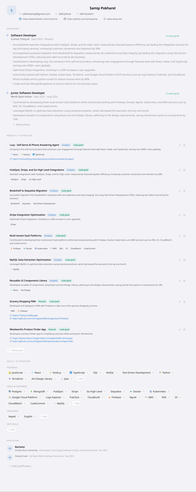
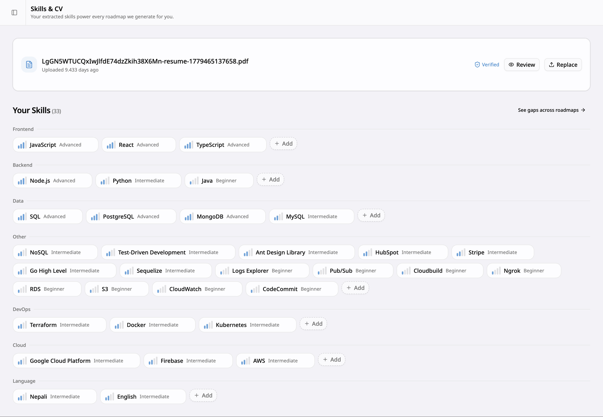
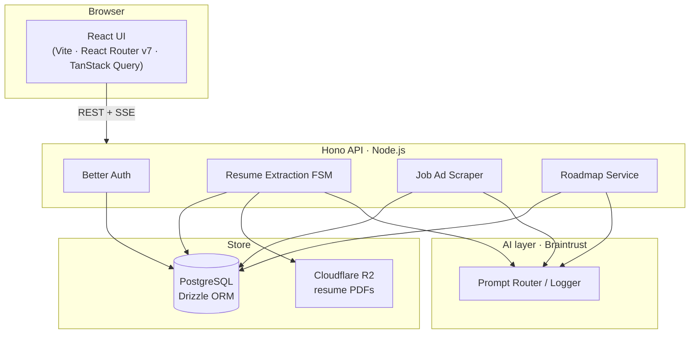
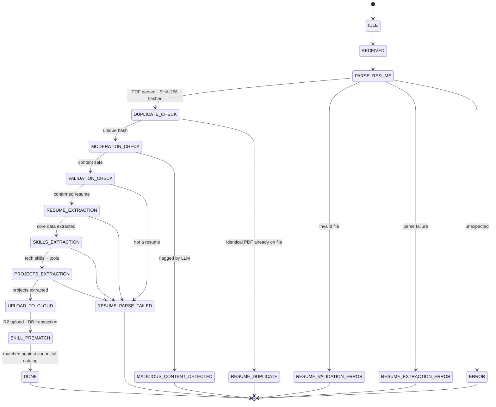
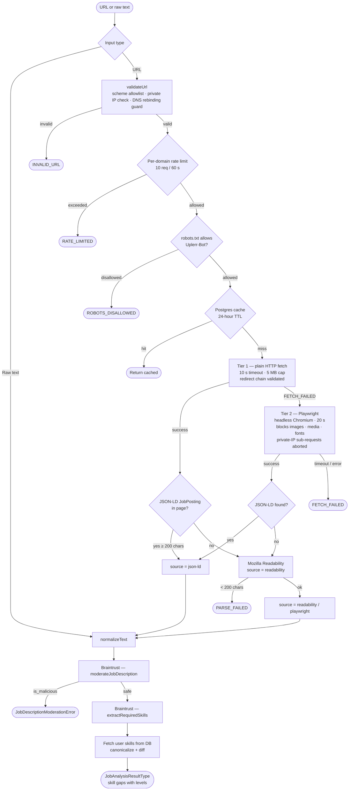
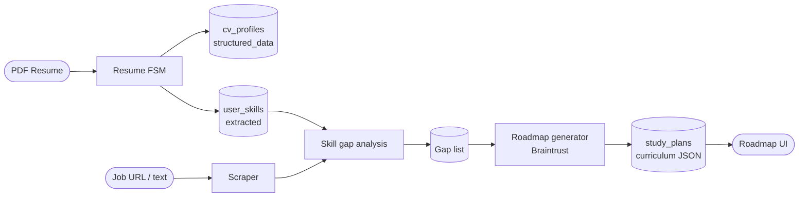

# Uplerr

**Upload your CV, paste any job posting, get a personalized learning roadmap.**

Uplerr analyses the gap between where you are and where a specific role requires you to be, then generates a month-by-month curriculum to close it.

---

I started Uplerr as a project that I intended to make public and see if I could get some users to use it but since that is not the case, I am taking the deployments down and making this public - free for anyone to setup and use.

---

## What it does

- **CV parsing**: upload a PDF resume; the pipeline extracts structured data (experience, education, skills, projects) using a custom finite state machine.
- **Job posting analysis**: paste a URL or raw job text; a tiered scraper fetches and cleans the page, then an LLM extracts the required skill set.
- **Skill gap analysis**: extracted skills are diffed against your profile to produce per-skill gap ratings.
- **Roadmap generation**: the gap list, your weekly availability, and a target date go into an LLM prompt that returns a structured curriculum of topics, subtopics, and milestones.
- **Progress tracking**: mark topics complete, attach your own resources to any subtopic, and archive old roadmaps.

## Screenshots

**Individual Roadmap View**


**CV Review Page**


**Skills & CV Page**


---

## Architecture



The stack is a pnpm monorepo managed with Turborepo:

| Package       | Role                                    |
| ------------- | --------------------------------------- |
| `src/api`     | Hono REST API with Drizzle + PostgreSQL |
| `src/ui`      | React SPA                               |
| `src/website` | Astro marketing site                    |
| `src/types`   | Shared Zod schemas and TypeScript types |

---

## Core: Resume Extraction FSM

The resume upload path is modelled as an explicit finite state machine rather than a chain of `try/catch` blocks. Each state has exactly one transition, and errors always route to a named terminal state - so you know what failed and why.



**What happens at each stage:**

| State                 | What happens                                                                                                                                              |
| --------------------- | --------------------------------------------------------------------------------------------------------------------------------------------------------- |
| `PARSE_RESUME`        | `pdf-parser` extracts raw text and embedded links; a SHA-256 hash is computed over the raw bytes for the duplicate check.                                 |
| `DUPLICATE_CHECK`     | Looks up the hash against the user's active CV. Exact byte-for-byte match → early exit with `RESUME_DUPLICATE`.                                           |
| `MODERATION_CHECK`    | LLM scans the raw text for malicious content (prompt injection, harmful payloads). Three violations auto-ban the account.                                 |
| `VALIDATION_CHECK`    | A second LLM call confirms the document is actually a resume (not a cover letter, terms of service, or arbitrary PDF).                                    |
| `RESUME_EXTRACTION`   | Extracts structured core data: name, contact, work history, education, certifications.                                                                    |
| `SKILLS_EXTRACTION`   | Extracts technical skills and tools/platforms as a separate pass to keep each prompt focused.                                                             |
| `PROJECTS_EXTRACTION` | Extracts side-projects and open-source work, including links harvested from the PDF.                                                                      |
| `UPLOAD_TO_CLOUD`     | Uploads the file to Cloudflare R2 and writes all structured data to PostgreSQL in a single transaction; deactivates the previous CV record if one exists. |
| `SKILL_PREMATCH`      | Runs a parallel lookup against the canonical skills catalog (direct slug match + alias table) to produce a `matched/total` stat shown in the UI.          |

---

## Core: Job Advertisement Scraper

The scraper uses a **three-tier fetch strategy** so it handles everything from simple static pages to fully JavaScript-rendered SPAs. It also enforces several security guards before touching any network.



**Security guards:**

| Guard                 | Detail                                                                                                              |
| --------------------- | ------------------------------------------------------------------------------------------------------------------- |
| Scheme allowlist      | Only `http:` and `https:` are accepted.                                                                             |
| Private IP block      | IPs resolving to RFC-1918 / loopback / link-local ranges are rejected before any request is made (SSRF protection). |
| Redirect validation   | Each hop in a redirect chain is re-validated; a public URL cannot redirect through a private IP.                    |
| robots.txt compliance | Per-origin `robots.txt` is fetched and cached in-process for 1 hour; disallowed paths are refused.                  |
| Rate limiting         | 10 requests per domain per 60-second window, enforced in-process.                                                   |
| Body size cap         | HTTP responses are streamed and aborted after 5 MB.                                                                 |
| HTML sanitisation     | Raw HTML is passed through DOMPurify before Readability to strip scripts and event handlers.                        |

---

## End-to-end: upload → analyse → roadmap



---

## Tech stack

| Layer                 | Technology                                                 |
| --------------------- | ---------------------------------------------------------- |
| API framework         | [Hono](https://hono.dev)                                   |
| ORM + migrations      | [Drizzle ORM](https://orm.drizzle.team)                    |
| Auth                  | [Better Auth](https://www.better-auth.com)                 |
| Database              | PostgreSQL 16                                              |
| File storage          | Cloudflare R2 (S3-compatible)                              |
| LLM routing + logging | [Braintrust](https://braintrust.dev)                       |
| Web scraping          | Playwright (Chromium) · Mozilla Readability · DOMPurify    |
| Frontend              | React 19 · React Router v7 · TanStack Query · Tailwind CSS |
| Marketing site        | Astro                                                      |
| Email (optional)      | Resend (falls back to stdout if key not set)               |
| Monorepo tooling      | pnpm workspaces · Turborepo                                |
| Tests                 | Vitest · v8 coverage (80 % function threshold)             |
| Containers            | Docker · nginx (UI + website) · tini (API)                 |

---

## Self-hosting

### Prerequisites

- Docker and Docker Compose
- A [Braintrust](https://braintrust.dev) account with prompts set up (see [prompts/README.md](prompts/README.md))
- A [Cloudflare R2](https://developers.cloudflare.com/r2/) bucket for resume storage
- _(Optional)_ A [Resend](https://resend.com) account for transactional email

### Quickstart

```bash
git clone https://github.com/samipsamip/Uplerr
cd Uplerr

cp .env.example .env
# fill in the required values — see the table below

docker compose up --build
```

| Service        | URL                   |
| -------------- | --------------------- |
| React UI       | http://localhost:3000 |
| Hono API       | http://localhost:8080 |
| Marketing site | http://localhost:4000 |

Database migrations run automatically on API start.

---

### Environment variables

| Variable                                            | Required    | Description                                                                                                     |
| --------------------------------------------------- | ----------- | --------------------------------------------------------------------------------------------------------------- |
| `POSTGRES_PASSWORD`                                 | ✅          | Password for the Postgres container.                                                                            |
| `API_URL`                                           | ✅          | Public URL of the API (e.g. `http://localhost:8080`).                                                           |
| `APP_URL`                                           | ✅          | Public URL of the React UI. Used for CORS.                                                                      |
| `WEBSITE_URL`                                       | ✅          | Public URL of the marketing site. Used for CORS.                                                                |
| `BRAINTRUST_API_KEY`                                | ✅          | Your Braintrust API key.                                                                                        |
| `BRAINTRUST_PROJECT_ID`                             | ✅          | Braintrust project ID.                                                                                          |
| `BRAINTRUST_PROJECT_NAME`                           | ✅          | Braintrust project name.                                                                                        |
| `BRAINTRUST_SLUG_IS_VALID_RESUME`                   | ✅          | Prompt slug for resume validation.                                                                              |
| `BRAINTRUST_SLUG_CORE_RESUME_EXTRACTION`            | ✅          | Prompt slug for core data extraction.                                                                           |
| `BRAINTRUST_SLUG_EXTRACT_SKILLS`                    | ✅          | Prompt slug for skills extraction.                                                                              |
| `BRAINTRUST_SLUG_RESUME_MODERATION`                 | ✅          | Prompt slug for resume moderation.                                                                              |
| `BRAINTRUST_SLUG_RESUME_PROJECTS_EXTRACTION`        | ✅          | Prompt slug for projects extraction.                                                                            |
| `BRAINTRUST_SLUG_JOB_DESCRIPTION_MODERATION`        | ✅          | Prompt slug for job description moderation.                                                                     |
| `BRAINTRUST_SLUG_JOB_DESCRIPTION_SKILLS_EXTRACTION` | ✅          | Prompt slug for job skills extraction.                                                                          |
| `BRAINTRUST_SLUG_ROADMAP_CURRICULUM`                | ✅          | Prompt slug for roadmap curriculum generation.                                                                  |
| `CLOUDFLARE_ACCOUNT_ID`                             | ✅          | Cloudflare account ID.                                                                                          |
| `CLOUDFLARE_ACCESS_KEY_ID`                          | ✅          | R2 access key.                                                                                                  |
| `CLOUDFLARE_SECRET_ACCESS_KEY`                      | ✅          | R2 secret key.                                                                                                  |
| `CLOUDFLARE_STORAGE_BUCKET`                         | ✅          | R2 bucket name.                                                                                                 |
| `RESEND_API_KEY`                                    | ☑️ optional | If set, sends transactional emails via Resend. If omitted, email links are printed to the API logs.             |
| `EMAIL_FROM`                                        | ☑️ optional | Sender address for outgoing emails (e.g. `Uplerr <noreply@yourdomain.com>`). Requires a verified Resend sender. |

---

### Braintrust prompt setup

All LLM prompts are managed in Braintrust and versioned separately from the application code. The `prompts/` directory contains the full text of each prompt so you can recreate them in your own Braintrust project.

See **[prompts/README.md](prompts/README.md)** for the complete setup guide.

---

## Development

The dev compose file mounts the source tree and runs the API with `tsx watch` so both the API and the React UI hot-reload on save.

```bash
cp .env.example .env
# fill in values

docker compose -f docker-compose.dev.yml up
```

Run the test suite:

```bash
pnpm install
pnpm test
```

---
